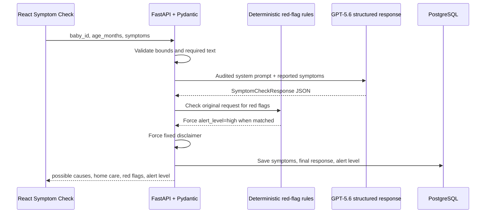
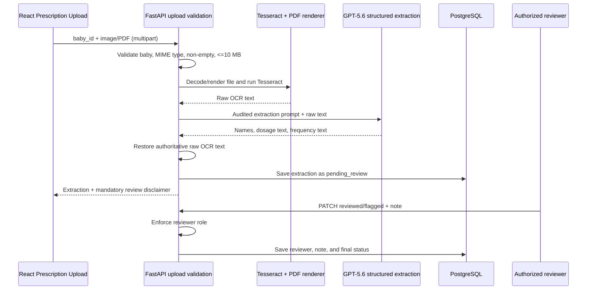

# Swaddle Architecture

Swaddle is a monorepo with a React/Vite client, a FastAPI service,
shared TypeScript and Pydantic contracts, and PostgreSQL persistence. The AI is
used only for structured assistance. FastAPI owns validation, safety overrides,
authorization, persistence, and HTTP errors.

## Repository map

| Area | Responsibility |
| --- | --- |
| `client/` | React pages, UI state, and typed API adapters |
| `server/app/` | FastAPI routes, business rules, AI orchestration, and SQLAlchemy models |
| `server/alembic/` | Versioned database migrations |
| `server/scripts/seed.py` | Deterministic demo data |
| `shared/types/` | Client-facing TypeScript interfaces mirrored by Pydantic models |

The browser calls `/api/*`. FastAPI validates each request with Pydantic before
running the route, and SQLAlchemy writes to PostgreSQL. OpenAI credentials remain
server-side and are never sent to the browser.

## Symptom-check data flow

`POST /api/assistant/symptom-check` provides educational, non-diagnostic
guidance. It deliberately has two safety layers: a constrained structured model
response and deterministic server-side red-flag enforcement.

1. `SymptomCheckRequest` rejects invalid baby IDs, blank symptoms, and ages
   outside 0–216 months.
2. The service sends the separately auditable system prompt from
   `server/app/assistant/constants.py`. It forbids medicine names, dosages, and
   diagnoses and requires the `SymptomCheckResponse` schema.
3. The OpenAI Responses API parses directly into that Pydantic schema. Missing
   or invalid structured output becomes HTTP 502; it is not persisted.
4. `contains_red_flag()` examines the caregiver's original text. Fever or
   temperature in a baby under three months and general red-flag patterns such
   as breathing difficulty, lethargy, seizure, blue skin, or severe dehydration
   force `alert_level` to `high`, even if the model selected a lower level.
5. The server overwrites the disclaimer with `This is not medical advice.`.
6. Only the final, server-enforced response is saved in `symptom_queries` and
   returned to the client.

This endpoint is not a diagnostic engine or emergency-service substitute. The
rule layer is intentionally independent of model judgment so a model response
cannot downgrade a recognized red flag.

## Prescription-extract data flow

`POST /api/prescriptions/extract` is transcription assistance, not medication
validation. OCR obtains the source text; GPT-5.6 only sorts verbatim spans into
fields.

1. FastAPI accepts only PDF, JPEG, PNG, TIFF, or WebP uploads up to 10 MB and
   verifies that the referenced baby exists.
2. Images go directly to Tesseract. PDF pages are rendered at increased
   resolution with PyMuPDF and then passed to Tesseract. Undecodable files or
   files with no extracted text return HTTP 422; unavailable Tesseract returns
   HTTP 503.
3. The prompt in `server/app/prescriptions/constants.py` permits extraction
   only. It prohibits correctness or safety judgments, recommendations,
   corrections, abbreviation expansion, and invention of missing information.
4. GPT-5.6 returns `medicine_names`, `dosage_text`, `frequency_text`, and
   `raw_ocr_text` using `PrescriptionExtraction`. The server then overwrites the
   model's `raw_ocr_text` with the actual Tesseract output, preserving the
   authoritative OCR source.
5. The result is stored with `pending_review` and the fixed disclaimer
   `Extracted text requires pharmacist/doctor review.`. The current demo stores
   a sanitized local-upload reference rather than retaining the uploaded bytes.
6. `PATCH /api/prescriptions/{id}/review` requires a reviewer user through the
   `X-User-Id` demo authentication dependency. Only `reviewed` or `flagged` plus
   a non-empty note is accepted.

The extraction result never claims that a medicine, strength, frequency, or
prescription is correct or safe. A pharmacist or doctor remains the decision
maker.

## Errors, testing, and operational boundaries

- Request-shape and value errors return HTTP 422 through Pydantic.
- Missing records return HTTP 404; booking conflicts return HTTP 409.
- Model schema failures return HTTP 502 and do not create database records.
- Tests replace OpenAI, OCR, and database dependencies with deterministic mocks;
  no external service is required by the pytest suite.
- Real authentication, durable object storage, production observability,
  real-time video, and 24-hour live consultation services are roadmap items and
  are outside this demo's scope.
